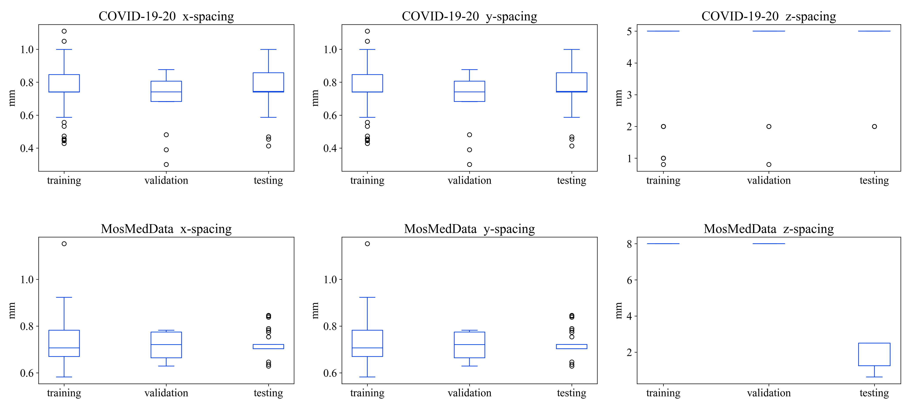

# Pseudo-Label Guided Image Synthesis for Semi-Supervised COVID-19 Pneumonia Infection Segmentation.

Implementation of [Pseudo-Label Guided Image Synthesis for Semi-Supervised COVID-19 Pneumonia Infection Segmentation].

Code is coming soon.

## Implementation

### 1. Installation

```python
pytorch==1.9.0
```

### 2. Datset Preparation

```bash
├── COVID249
│   ├── NII (Original dataset in NIFTI)
│   ├── PNG (Pre-processed dataset in PNG)
│   ├── train_0.1_l.xlsx (datasplit for 10% setting)
│   ├── train_0.1_u.xlsx (datasplit for 10% setting)
│   ├── train_0.2_l.xlsx (datasplit for 20% setting)
│   ├── train_0.2_u.xlsx (datasplit for 20% setting)
│   ├── train_0.3_l.xlsx (datasplit for 30% setting)
│   ├── train_0.3_u.xlsx (datasplit for 30% setting)
│   ├── test_slice.xlsx (datasplit for testing)
│   ├── val_slice.xlsx (datasplit for validation)
├── MOS1000
│   ├── NII (Original dataset in NIFTI)
│   ├── PNG (Pre-processed dataset in PNG)
│   ├── train_l.xlsx (datasplit)
│   ├── train_u.xlsx (datasplit)
│   ├── test_slice.xlsx (datasplit for testing)
│   ├── val_slice.xlsx (datasplit for validation)
```
- Convert the nifti images to int32 png format, then subtract 32768 from the pixel intensities to obtain the original Hounsfield unit (HU) values, saved in Image folder, similar to the processing steps in [Deeplesion](https://nihcc.app.box.com/v/DeepLesion/file/306055882594).
- The lung regions can be extracted by a leading lung segmentation model provided by  [JoHof](https://github.com/JoHof/lungmask).


### 3. Training Models

```python
python train_SACPS.py
python train_SAST.py
```

### 4. Training New Models

We have provided a template for training new models, where we have implemented the dataloader, optimizer, etc.  

```python
    for epoch in range(max_epoch):
        print("Start epoch ", epoch+1, "!")

        tbar = tqdm(range(len(unlabeled_dataloader)), ncols=70)
        labeled_dataloader_iter = iter(labeled_dataloader)
        unlabeled_dataloader_iter = iter(unlabeled_dataloader)

        for batch_idx in tbar:
            try:
                input_l, target_l, file_name_l , lung_l = labeled_dataloader_iter.next()
            except StopIteration:
                labeled_dataloader_iter = iter(labeled_dataloader)
                input_l, target_l, file_name_l , lung_l = labeled_dataloader_iter.next()

            # load data
            input_ul, target_ul, file_name_ul , lung_ul = unlabeled_dataloader_iter.next()
            input_ul, target_ul, lung_ul = input_ul.cuda(non_blocking=True), target_ul.cuda(non_blocking=True), lung_ul.cuda(non_blocking=True)
            input_l, target_l, lung_l = input_l.cuda(non_blocking=True), target_l.cuda(non_blocking=True), lung_l.cuda(non_blocking=True)


            # Add new impelmentation here: design the training process
            #-------------------------------------------------------------
            #*************************************************************
            #-------------------------------------------------------------


            optimizer.zero_grad()
            loss.backward()
            optimizer.step()
            lr_ = base_lr * (1.0 - iter_num_s / max_iterations_s) ** 0.9
            for param_group in optimizer_s.param_groups:
                param_group['lr'] = lr_

            iter_num = iter_num + 1
            writer.add_scalar('info/lr', lr_, iter_num)
            writer.add_scalar('info/total_loss', loss, iter_num)
            logging.info('iteration %d : loss : %f' % (iter_num, loss.item()))
    writer.close()
```

### 5. Testing

```python
python segment_test.py
```

```python
def test(args, snapshot_path):
    model = net_factory(net_type=args.model)
    model.load_state_dict(torch.load(args.model_path))
    model.eval()

    nsd, dice = get_model_metric(args = args, model = model, snapshot_path=snapshot_path, model_name='model', mode='test')
    print('nsd : %f dice : %f ' % (nsd, dice))
```

- snapshot_path: folder for saving results.
- args.model: model type.
- args.model_path: trained model path.
- get_model_metric(): which includes prediction, png2nifti, calculate_nsd_dsc.

## Suplementary information


1. Statistics of the datasets.

Descriptive statistics, including x-, y- and z-spacing, of both datasets are shown as follow.

<p align="center">
    
</p>


2. Links for competing methods.
- [Self-Ensembling]: [JBHI 2021](https://ieeexplore.ieee.org/abstract/document/9511146);  [code](https://github.com/CaiziLee/SECT)
- [Cross Pseudo Supervision]: [CVPR 2021](https://openaccess.thecvf.com/content/CVPR2021/papers/Chen_Semi-Supervised_Semantic_Segmentation_With_Cross_Pseudo_Supervision_CVPR_2021_paper.pdf);  [code](https://github.com/charlesCXK/TorchSemiSeg)
- [Uncertainty-Aware Mean-Teacher]: [CVPR 2021](https://link.springer.com/chapter/10.1007/978-3-030-32245-8_67);  [code](https://github.com/yulequan/UA-MT)
- [Cross-Consistency Training]: [CVPR 2020](https://openaccess.thecvf.com/content_CVPR_2020/papers/Ouali_Semi-Supervised_Semantic_Segmentation_With_Cross-Consistency_Training_CVPR_2020_paper.pdf);  [code](https://github.com/yassouali/CCT)
- [Uncertainty-guided Dual-Consistency]: [MICCAI 2021](https://link.springer.com/chapter/10.1007/978-3-030-87196-3_19);  [code](https://github.com/poiuohke/UDC-Net)
- [SemiInfNet]: [TMI 2020](https://ieeexplore.ieee.org/abstract/document/9098956);  [code](https://github.com/DengPingFan/Inf-Net)
- [Self-Training]: [NeurIPS 2020](https://proceedings.neurips.cc/paper/2020/hash/27e9661e033a73a6ad8cefcde965c54d-Abstract.html);  [code](https://github.com/tensorflow/tpu/tree/master/models/official/detection/projects/self_training)


